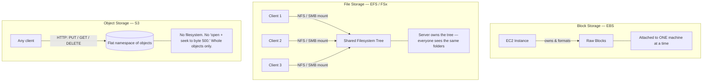
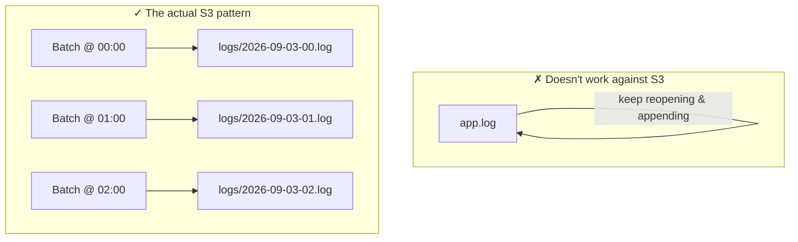
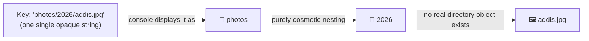
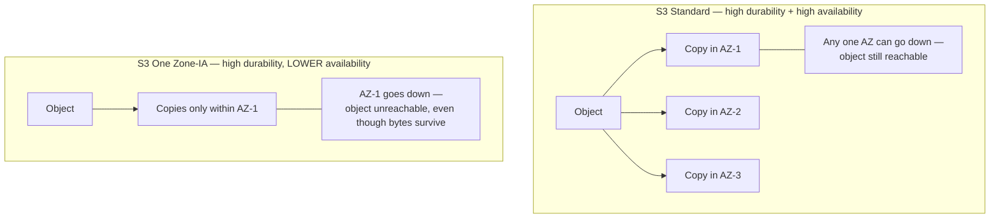

# Session 09 (1/5): Object Storage Fundamentals

## Quick reference

| | Block (EBS) | File (EFS/FSx) | Object (S3) |
|---|---|---|---|
| Who owns the filesystem | Your OS | The server | Nobody — there is none |
| Access pattern | Raw blocks, byte-level seek | Mount + folder tree | HTTP verbs on a key |
| Attached to | One machine | Many clients at once | Any client, anywhere |
| Can you edit in place? | Yes | Yes | No — whole object only |

---

## 1. Three genuinely different storage models, not three tiers of one thing

It's tempting to think of Block → File → Object as a ladder of "more managed"
versions of the same thing. They aren't. Each one answers a different
question about **who is responsible for the filesystem**, and that changes
everything downstream.

- **Block storage (EBS)** — raw blocks. The client (your OS) owns the
  filesystem, formats the disk, tracks what's where. Attached to one machine.
- **File storage (EFS/FSx)** — the server owns a real filesystem with
  folders; multiple clients mount it over the network (NFS/SMB) and see the
  same tree simultaneously.
- **Object storage (S3)** — no filesystem at all. A flat namespace of opaque
  objects, each with a key, accessed entirely through an HTTP API: `PUT`,
  `GET`, `DELETE`. There's no "open a file and seek to byte 500."

---

## 2. The real consequence: objects are immutable

You cannot append to an object or modify part of it. Uploading a "new
version" always means uploading an entirely new object.

A logging pattern that continuously appends lines to one growing file does
not work against S3 — the standard pattern is writing many small, complete
objects (one per interval, one per batch), never one object you keep
reopening and extending.

---

## 3. Keys aren't paths — the slash is cosmetic

`photos/2026/addis.jpg` is one single opaque string key. S3 has no real
folder `photos/2026/` — the console renders slashes as folder-like
navigation purely for convenience; there's no directory object underneath.

> **Historical note worth knowing:** extremely high-throughput workloads used
> to bottleneck when many objects shared an identical key *prefix*, due to
> how S3 partitioned keys internally. AWS re-architected this years ago and
> it's largely a non-issue today, but "randomize key prefixes for very high
> request rates" is a question that tests whether you know S3's internals go
> deeper than "a bucket of files."

---

## 4. Durability vs availability — not the same number

These two get merged in people's heads constantly. Keep them separate:

| | Durability | Availability |
|---|---|---|
| Question it answers | Will AWS ever *lose* my bytes? | Can I *reach* my bytes right now? |
| S3 Standard | 99.999999999% (eleven 9s) | Very high (multi-AZ) |
| S3 One Zone-IA | Still very high (redundant *within* that one AZ) | Lower (one AZ outage = objects unreachable) |
| Mechanism | Replication of the *bytes* | Replication of *access paths* (AZs) |

**99.999999999% (eleven nines) is durability** — the probability AWS never
loses your bytes, from automatically replicating every object across
multiple AZs. **Availability is separate and lower** — whether you can
successfully reach and read the object right now. Standard is extremely
strong on both. A class like One Zone-IA trades away multi-AZ replication
for a discount, which specifically lowers availability (durability stays
high via redundancy within that one AZ, but the whole AZ becoming
unreachable takes the object with it).

---

## Interview line

*"S3 is object storage — a flat namespace accessed by API, not a filesystem.
Objects are immutable, which shapes real design patterns like
write-many-small-objects instead of append-to-one. Durability and
availability are different guarantees: eleven nines durability means AWS
won't lose the bytes; availability is whether you can reach them right now,
and storage classes trade one against the other."*

---
