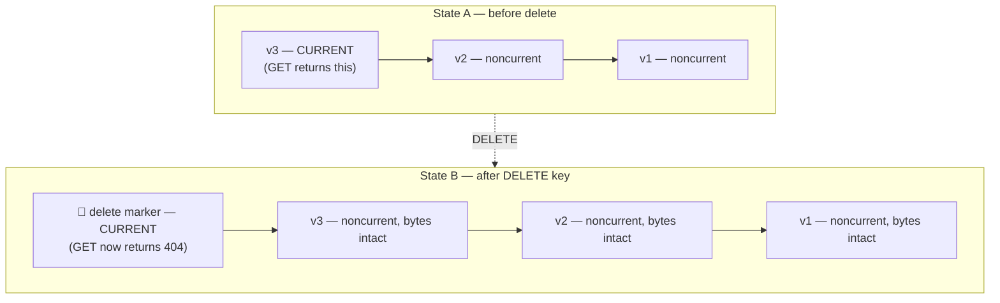
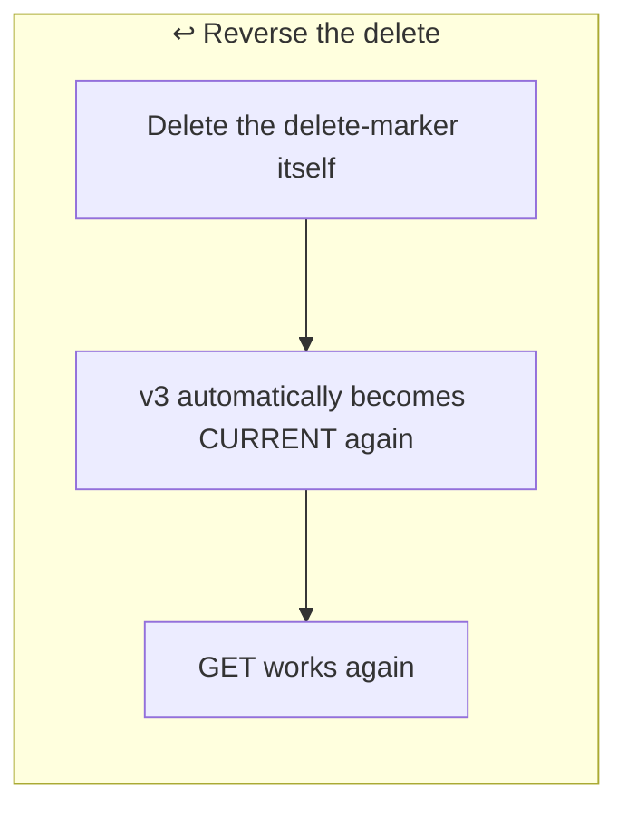
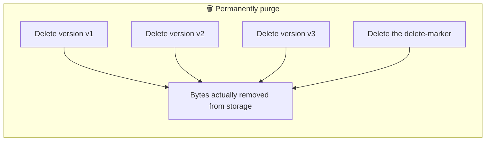
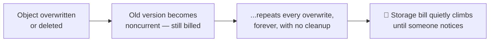
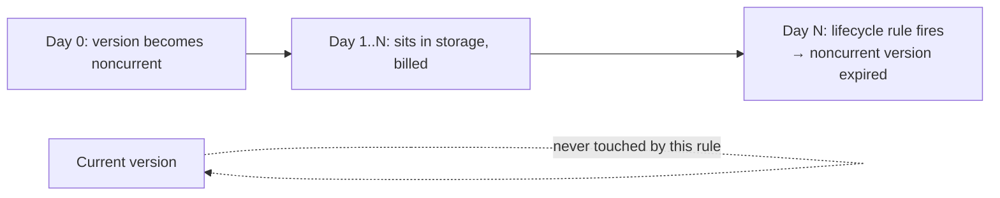
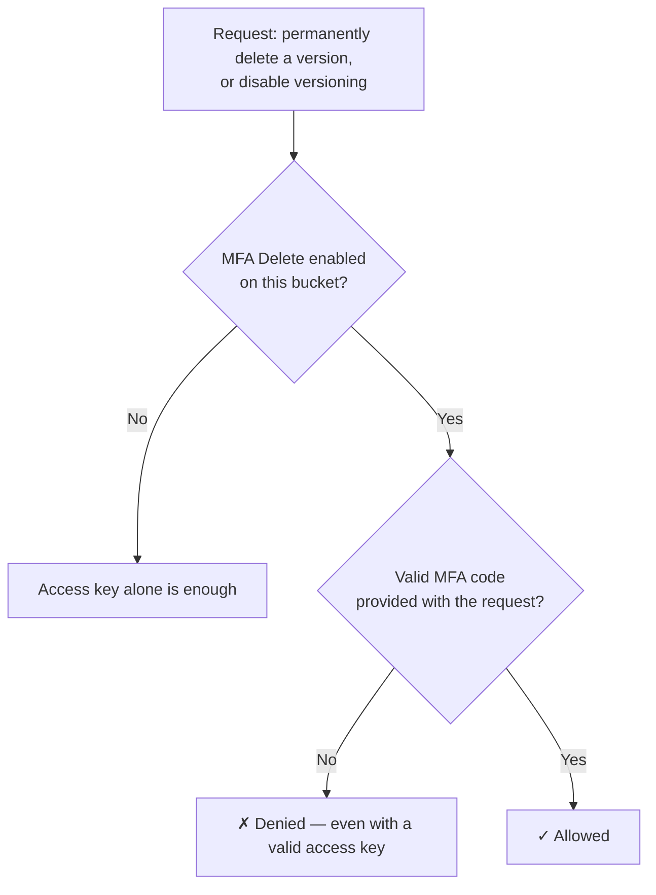

# Session 09 (2/5): Versioning — What "Delete" Actually Does

## Quick reference

| Action | What actually happens |
|---|---|
| `DELETE` a key (versioning on) | Adds a **delete marker** as the new current version; `GET` → 404; old versions untouched and still billed |
| Delete the delete marker | Previous version automatically becomes current again — object "reappears" |
| Delete a specific version ID | That version's bytes are **permanently, irreversibly** removed |
| Lifecycle rule on noncurrent versions | Auto-expires old versions after N days; current version untouched |
| MFA Delete | Requires MFA to permanently delete a version, or to disable versioning |

---

## 1. A delete marker, not a deletion

On a versioned bucket, deleting a key doesn't delete anything. It adds a
**delete marker** as the new current version of that key. `GET` on that key
now returns 404 — it looks deleted — but every previous version's bytes are
still in storage, intact, and still billed.

Nothing left State A actually got removed — a new marker just got stacked
on top and became the thing `GET` sees.

---

## 2. Reversing it vs. actually purging it

These are two completely different operations, and it's easy to conflate
them:

To reverse the delete: delete the delete-marker itself, and the previous
version automatically becomes current again. To actually, permanently purge
data: delete each specific version ID individually — "empty the trash" isn't
one click, it means targeting the real versions.

---

## 3. Why versioning quietly inflates the bill

Someone enables versioning as a safety net (correctly), then every
overwrite and delete keeps accumulating old versions forever, with nobody
watching the growing storage cost until the bill spikes. This is a real,
common incident — not a hypothetical.

**The fix is not "don't use versioning."** It's pairing versioning with a
lifecycle rule that targets **noncurrent versions** specifically — expire
old versions after N days while the current version stays untouched.

This combination (safety net now, automatic cleanup later) is what you
build in the hands-on lab.

---

## 4. MFA Delete

For genuinely critical buckets, MFA Delete requires multi-factor
authentication to permanently delete a version or to disable versioning
itself — an extra gate specifically against a compromised access key being
enough on its own to wipe data.

---

## Interview line

*"Versioning doesn't remove data on delete — it adds a delete marker as the
new current version, and every prior version stays in storage until
explicitly purged. This makes versioning a real safety net against
accidental overwrites and deletes, but it also means storage cost grows
forever unless paired with a lifecycle rule that expires noncurrent
versions."*

---
