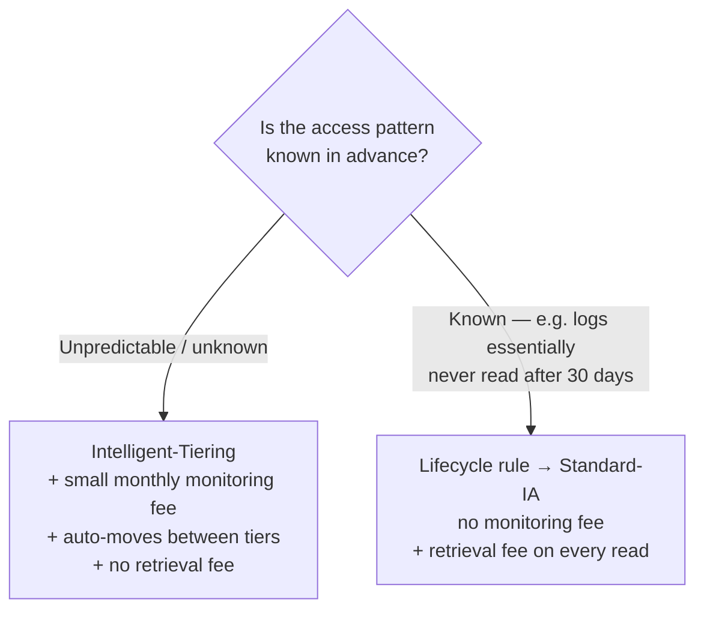
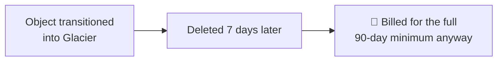
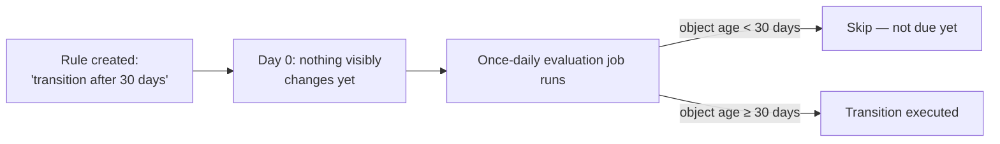
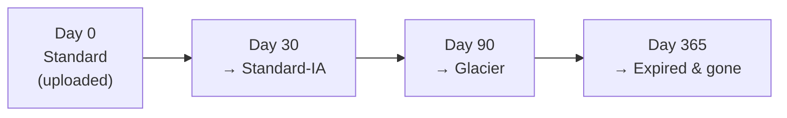

# Session 09 (3/5): Storage Classes & Lifecycle Rules

## Quick reference

| Storage class | Minimum billed duration | Retrieval fee |
|---|---|---|
| Standard | none | none |
| Intelligent-Tiering | none (small per-object monitoring fee instead) | none |
| Standard-IA / One Zone-IA | 30 days | yes, per read |
| Glacier Flexible Retrieval | 90 days | yes |
| Deep Archive | 180 days | yes |

---

## 1. Intelligent-Tiering vs Standard-IA — different tools, not tiers of one

**Intelligent-Tiering** charges a small monthly per-object monitoring fee
and automatically moves objects between access tiers based on real observed
usage, with no retrieval fee. **Standard-IA** is manually or rule-triggered
and does charge a retrieval fee every time the data is read back.

The real decision: if the access pattern is genuinely unpredictable,
Intelligent-Tiering's monitoring fee is worth it to avoid guessing wrong. If
the pattern is already known, a lifecycle rule into Standard-IA is cheaper —
no monitoring fee paid for certainty already held.

---

## 2. The gotcha: minimum storage duration charges

- Standard-IA / One Zone-IA — minimum 30 days billed, even if deleted or
  transitioned sooner.
- Glacier Flexible Retrieval — minimum 90 days.
- Deep Archive — minimum 180 days.

Transition an object into Glacier and delete it a week later, and it's
billed as if kept the full minimum period anyway. This is a real, common way
lifecycle rules end up costing *more* than expected — the aging thresholds
were set too aggressively relative to how long the data actually needed to
live.

---

## 3. Lifecycle rules run on a schedule, not instantly

A rule evaluates once a day and only acts on objects that have actually
crossed the age threshold. Create a rule transitioning objects after 30
days, and nothing visibly changes today — that's expected, not broken.

---

## 4. A typical real lifecycle for log files

One rule, no ongoing effort, storage cost matches actual access pattern
automatically.

---

## Interview line

*"Storage classes trade cost against retrieval speed and fee.
Intelligent-Tiering pays a monitoring fee to handle unpredictable access
automatically; Standard-IA and Glacier are cheaper when the access pattern
is already known, at the cost of manual rule-setting and minimum storage
duration charges that can backfire if objects are deleted too early.
Lifecycle rules run on a daily schedule, so nothing transitions the moment a
rule is created."*

---

## Self-check before moving on

1. When would Intelligent-Tiering actually save money over a manually
   configured lifecycle rule, and when would it cost more?
2. Why can transitioning an object into Glacier and deleting it a week later
   end up more expensive than expected?
3. Why doesn't anything visibly change immediately after creating a
   lifecycle rule?
